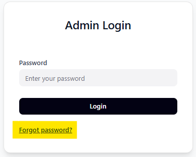
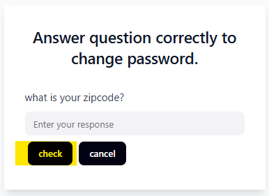
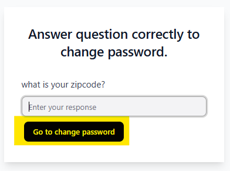
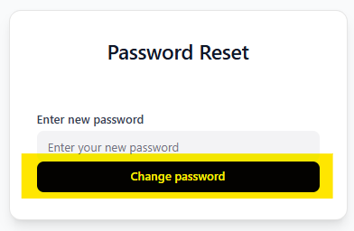
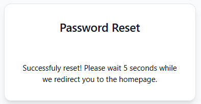

# CS633 Team1

## About
PGCQM is a webapp expanding on [this](https://alexelentukh.webflow.io/) website that will contain the course material for CS633. Students who visit the site will be able to view slides from the six total modules taught in class as mini lessons. Each module will contain a slide for
* key concepts
* a summary of the lesson
* important principles
* Do nots
* a quiz
* and a FAQ for that particular module

## Access the project code 
[Click here to see the project repository](https://github.com/ramired2/CS633-team1)

## Access the backend on Render
[Click here to see the deployed backend](https://pgcqm-backend.onrender.com/)

## Access the website on Render
[Click here to see the deployed webapp](https://pgcqm.onrender.com/)

## Important 
* All login information will be included in the project documentation
* Before uploading a deck
    - Ensure content is not near edges of slide as some content may be cut off
    - Ensure naming conventions are being followed. A deck should</br>have "Module <#>.ppt/x" at the end of the name to ensure it is placed in the correct module.

* After uploading a deck
    - Double check each slide looks as desired in the Student View as some images, text, or items may have shifted or were cut off during ppt --> png conversion
* Recommended Fonts
    - Calibri
    - Arial
    - Times New Roman
* If many requests to the backend are done within a small timeframe, Render may cancel requests with a "Ran out of memory" error as the free plan only allows 512MG of memory. Simply wait a couple minutes before another attempt.

## Password Reset
<details>
<summary>If you forget your password...</summary>

#### Step 1

* Click on “Forgot Password”

#### Step 2

* Enter your response and click “check"

#### Step 3

* Once you successfully answer the question, click “Go to change password”. This will redirect you to the reset link.

#### Step 4

* Input your desired password and click “change password”

#### Step 5

* If successful, you will get a success message and be redirected to the main site within five seconds

### Reset Password Link
If you forget your password or simply do not want to go through the steps, there is a special [link](https://pgcqm.onrender.com/resetPassword) where you can just copy and paste onto a web browser and it will instantly take you to step 4.

</details>

## Frameworks
* ReactJS
* Python Flask
* MongoDB

## How to Run the project...
* Backend
    ```
    .venv\Scripts\activate
    pip install -r requirements.txt
    flask run --debug
    ```
* Frontend
    ```
    npm install
    npm run dev
    ```

## Software Packages 
<details>
<summary>Backend Packages — requirements.txt</summary>

* aspose_slides==25.9.0
* blinker==1.9.0
* click==8.2.1
* colorama==0.4.6
* dnspython==1.16.0
* dotenv==0.9.9
* Flask==3.1.2
* flask-cors==6.0.1
* Flask-Mail==0.10.0
* Flask-Redmail==0.3.0
* itsdangerous==2.2.0
* Jinja2==3.1.6
* MarkupSafe==3.0.2
* mysql-connector-python==9.4.0
* pillow==11.3.0
* plum-dispatch==1.7.4
* pymongo==3.12.0
* python-dotenv==1.1.1
* redmail==0.6.0
* spire-presentation==10.8.1
* Werkzeug==3.1.3

</details>

<details>
<summary>Reacts Packages — package.json</summary>

* "@radix-ui/react-accordion": "^1.2.3",
* "@radix-ui/react-alert-dialog": "^1.1.6",
* "@radix-ui/react-aspect-ratio": "^1.1.2",
* "@radix-ui/react-avatar": "^1.1.3",
* "@radix-ui/react-checkbox": "^1.1.4",
* "@radix-ui/react-collapsible": "^1.1.3",
* "@radix-ui/react-context-menu": "^2.2.6",
* "@radix-ui/react-dialog": "^1.1.6",
* "@radix-ui/react-dropdown-menu": "^2.1.6",
* "@radix-ui/react-hover-card": "^1.1.6",
* "@radix-ui/react-label": "^2.1.2",
* "@radix-ui/react-menubar": "^1.1.6",
* "@radix-ui/react-navigation-menu": "^1.2.5",
* "@radix-ui/react-popover": "^1.1.6",
* "@radix-ui/react-progress": "^1.1.2",
* "@radix-ui/react-radio-group": "^1.2.3",
* "@radix-ui/react-scroll-area": "^1.2.3",
* "@radix-ui/react-select": "^2.1.6",
* "@radix-ui/react-separator": "^1.1.2",
* "@radix-ui/react-slider": "^1.2.3",
* "@radix-ui/react-slot": "^1.1.2",
* "@radix-ui/react-switch": "^1.1.3",
* "@radix-ui/react-tabs": "^1.1.3",
* "@radix-ui/react-toggle": "^1.1.2",
* "@radix-ui/react-toggle-group": "^1.1.2",
* "@radix-ui/react-tooltip": "^1.1.8",
* "axios": "^1.12.2",
* "class-variance-authority": "^0.7.1",
* "clsx": "*",
* "cmdk": "^1.1.1",
* "embla-carousel-react": "^8.6.0",
* "input-otp": "^1.4.2",
* "lucide-react": "^0.487.0",
* "next-themes": "^0.4.6",
* "react": "^18.3.1",
* "react-day-picker": "^8.10.1",
* "react-dom": "^18.3.1",
* "react-hook-form": "^7.55.0",
* "react-loader-spinner": "^7.0.3",
* "react-resizable-panels": "^2.1.7",
* "react-router-dom": "^7.9.4",
* "recharts": "^2.15.2",
* "sonner": "^2.0.3",
* "tailwind-merge": "*",
* "toastr": "^2.1.4",
* "vaul": "^1.1.2"

</details>